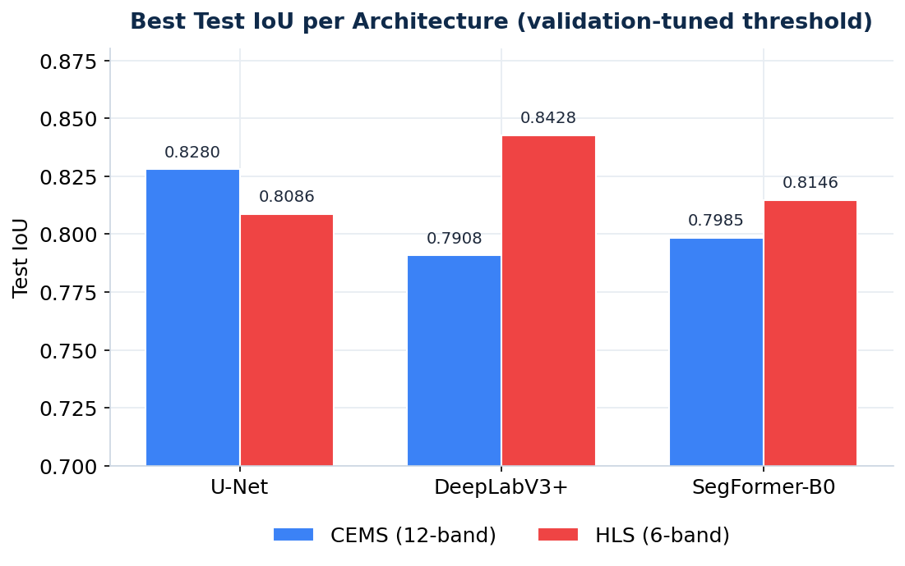

# SatRisk-Net


**Optimization of Neural Networks for Satellite Imagery–Based Disaster Risk Monitoring**

Wildfire burn-scar semantic segmentation from Sentinel-2 imagery: three architectures — **U-Net**, **DeepLabV3+**, and **SegFormer-B0** — benchmarked on two public datasets, optimized for low-power edge inference on **NVIDIA Jetson Orin Nano** with TensorRT, and served through an interactive **Leaflet + React** web interface.

**Demo video:** https://drive.google.com/file/d/1uj1tJDoTFeH48pcT2wwZlWkMvvSxKI_a/view

**Live demo:** https://satrisk-net.vercel.app

**Full study:** [`report/SatRiskNet-Report.pdf`](report/SatRiskNet-Report.pdf)

> Senior project — Hacettepe University, Department of Computer Engineering, 2025–2026.
> This is my fork of the team project. Upstream repository: [mustafa-ege/satrisk-net](https://github.com/mustafa-ege/satrisk-net).

---

## Headline result

| Dataset | Best model | Test IoU |
|---|---|---|
| CEMS (12-band) | U-Net | **0.8280** |
| HLS (6-band) | DeepLabV3+ | **0.8428** |



---

## Key findings

- **SegFormer recovery.** A naively-trained SegFormer-B0 collapses to **0.11 IoU** on CEMS. Patch-embedding surgery (RGB → 12-channel), ADE20K-pretrained initialization, a transformer-appropriate learning rate, warmup, and gradient clipping recover it to **≥ 0.80 IoU** on both datasets.
- **The best architecture is dataset-size dependent.** U-Net wins on the smaller CEMS (281 train) at 0.8280; DeepLabV3+ wins on the larger HLS (459 train) at 0.8428 and gains the most from the extra data.
- **CNNs and Transformers prefer different test-time methodologies.** CNNs benefit from resize-to-fixed evaluation; SegFormer prefers native-resolution center crops.
- **Edge deployment.** An aggressively-pruned U-Net compiled to a FP16 TensorRT engine runs at **~137 ms per 512×512 tile, ~19 img/s, under 6 W** on Jetson Orin Nano at the 15 W operating point — which, counterintuitively, is more power-efficient than the 7 W mode.
- **Structured pruning preserves accuracy.** ~25% structured channel pruning of the U-Net matches (slightly exceeds) baseline IoU while lowering latency across every power mode.

---

## Method at a glance

**Datasets.** Copernicus EMS (CEMS, 12-band Sentinel-2 L2A) and IBM–NASA HLS Burn Scars (6-band). Both are small (a few hundred labelled tiles) and class-imbalanced.

**Architectures.** U-Net (custom from-scratch and ResNet-encoder variants), DeepLabV3+ (ResNet-50), and SegFormer-B0 (MiT-B0), each adapted from 3-channel RGB to 6/12-channel multispectral input — for the Transformer via first-convolution patch-embedding surgery that preserves the pretrained RGB weights.

**Training.** AdamW with warmup + cosine schedule, gradient clipping, mixed precision, masked BCE (+ Dice) losses, and deterministic seeding. Inference is strengthened with SWA, test-time augmentation, model ensembling, and **validation-tuned** binarization thresholds (no test-set leakage).

**Edge pipeline.** PyTorch → ONNX → FP16 TensorRT, with a structured-pruning sweep on a host GPU and on-device benchmarking across four Jetson power modes (7 W / 15 W / 25 W / MAXN).

Full methodology, tables, and figures are in the [project report](report/SatRiskNet-Report.pdf).

---

## Repository structure

```text
.
├── backend/                       # FastAPI inference backend
├── frontend/                      # React + Leaflet web interface
├── model-experiments/             # Training & evaluation notebooks
│   ├── CEMS-FINAL-Models.ipynb    #   CEMS: U-Net / DeepLabV3+ / SegFormer-B0
│   └── HLS-FINAL-Models.ipynb     #   HLS:  U-Net / DeepLabV3+ / SegFormer-B0
├── report/
│   └── SatRiskNet-Report.pdf      # Full project report
├── figures/                       # Result figures and charts
├── models/                        # Model configuration files
├── LICENSE
└── README.md
```

---

## Team and contributions

Built by the five-member **Satellite Imagery** team as a senior project at Hacettepe University (advisor: Asst. Prof. Dr. Selma Dilek).

| Member | Profile |
|---|---|
| Emre Erdoğan | [GitHub](https://github.com/emreedgan) |
| Emre Yeğin | [GitHub](https://github.com/yeginemre) |
| Özgün Serergün Koca | [GitHub](https://github.com/ozgun-koca) |
| Mustafa Ege | [GitHub](https://github.com/mustafa-ege) |
| Kağan Canerik | [GitHub](https://github.com/KaganCanerik) |

### My contributions

I was involved in four of the project's five stages:

- **Data.** Evaluated several candidate burn-scar datasets and helped define the selection criteria that led to the final CEMS + HLS choice.
- **Model training.** Trained the three HLS-dataset models (U-Net, DeepLabV3+, SegFormer-B0) and contributed to the CEMS model training.
- **Evaluation.** Worked on model evaluation and the results, the visual presentation of those results, and the ablation / hyperparameter-search studies.
- **Edge optimization.** Contributed to the pre-deployment pruning study — establishing structured pruning as the effective approach over unstructured pruning, and identifying the ~25% compression "sweet spot" used for the deployed TensorRT engine.

---

## License

Released under the **MIT License** — see [`LICENSE`](LICENSE).

---

## References

- Ronneberger, O., Fischer, P., & Brox, T. (2015). *U-Net: Convolutional Networks for Biomedical Image Segmentation.* MICCAI.
- Chen, L.-C., Zhu, Y., Papandreou, G., Schroff, F., & Adam, H. (2018). *Encoder-Decoder with Atrous Separable Convolution for Semantic Image Segmentation.* ECCV.
- Xie, E., Wang, W., Yu, Z., Anandkumar, A., Alvarez, J. M., & Luo, P. (2021). *SegFormer: Simple and Efficient Design for Semantic Segmentation with Transformers.* NeurIPS.
- Jakubik, J., Roy, S., Phillips, C., Fraccaro, P., et al. (2023). *Foundation Models for Generalist Geospatial Artificial Intelligence (Prithvi-100M).* arXiv:2310.18660.
